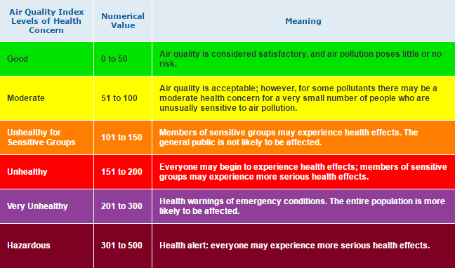

This package is developed to access real-time air pollute PM2.5 level near you, or at any city around the world. It is also developed with the intention to increase awareness about the dangerous of air pollution to the human health, particularly in some developing country. 


```{r}
require(globalPM25)
```

## What is PM2.5 and why it is dangerous to you and your family's health

PM2.5 refers to atmospheric particulate matter (PM) that have a diameter less than 2.5 micrometers. PM2.5 can come from various sources. Many experts believe that two main sources are power plants and motor vehicles. The effects of inhaling PM that have been widely studied in humans and animals include asthma, lung cancer, cardiovascular disease, respiratory diseases, premature delivery, birth defects, and premature death. Please refer to the wikipedia page [Particulate Matter](https://en.wikipedia.org/wiki/Particulates) about PM's health effects and more.  


## How is PM2.5 measured?

According to US EPA, PM2.5 is quanlitatively measured by AQI  (air quality index) and qualitatively measured by APL (air pollution level). 



Please refer to US EPA official website [airnow.gov](https://airnow.gov/index.cfm?action=aqibasics.aqi) for more information. In this package, both AQI and APL are provided. 


## Data source 

The real-time PM2.5 data feed are from [WAQ (World Air Quality) Project](www.aqicn.org) via JSON API. According to WAQ, "Real-time Air Quality information is available for than 9000 stations in 800 major cities from 70 countries, thanks to the huge effort from the world EPAs (Environmental Protection Agencies)." 

To use globalPM25 package to access real-time PM2.5 data feed, users are suggested to request a personal token from WAQ website. Then the personal token can be set in the package using
```{r, eval=FALSE}
settoken()
```

To request your personal token, please visit this [link](http://aqicn.org/data-platform/token/). For more about JSON API, please visit this [link](http://aqicn.org/json-api/doc/).


## Functions and data overview 

There are 9 functions/.R files in the package. Below are the function name and a short description. 

1. settoken(token): set your personal token requested from WAQ website

1. processPMdata(data): process raw AQI data feed. extract information such as AQI, APL local time, address, and geographical location into a dataframe  

1. getPMbyCityNames(citynames): query PM2.5 level by a city name or a vector of city names. this function will request real-time feed and proces the feed by calling processPMdata. Output is organized in a dataframe. 

1. getPMbylatlon(latitude, longitude): similar to getPMbyCityNames but query by a latitidue and a longitude instead of a city name

1. getPMnearme(): similar to getPMbyCityNames but query by a station closest to you based on computer IP address.  

1. getPMinRegion(): similar to getPMbyCityNames but query by a list of stations in a region. The region can be defined in two ways: a) a city name and a distance range. b) a rectangular boundary defined by latitude and longitude at opposite corners. 

1. plotPMdat(): demo to plot some results

1. zzz.R(): use to suppress no global variable binding note. 

1. global.R: set access to some variables such as token, WAQ url, etc.

There are 2 data sets, which are:

1. "usdat.rda": this contains PM2.5 data collected from stations at continental USA. the data are sampled at 4pm PST, March 19, 2017

1. "worlddat.rda": this contains PM2.5 data collected from a list of large cities worldwide. the city list can be found and set in global.R. the data are sampled at 4pm PST, March 19, 2017


You can enable figure captions by `fig_caption: yes` in YAML:

    output:
      rmarkdown::html_vignette:
        fig_caption: yes

Then you can use the chunk option `fig.cap = "Your figure caption."` in **knitr**.

## More Examples

You can write math expressions, e.g. $Y = X\beta + \epsilon$, footnotes^[A footnote here.], and tables, e.g. using `knitr::kable()`.

```{r, echo=FALSE, results='asis'}
knitr::kable(head(mtcars, 10))
```

Also a quote using `>`:

> "He who gives up [code] safety for [code] speed deserves neither."
([via](https://twitter.com/hadleywickham/status/504368538874703872))
